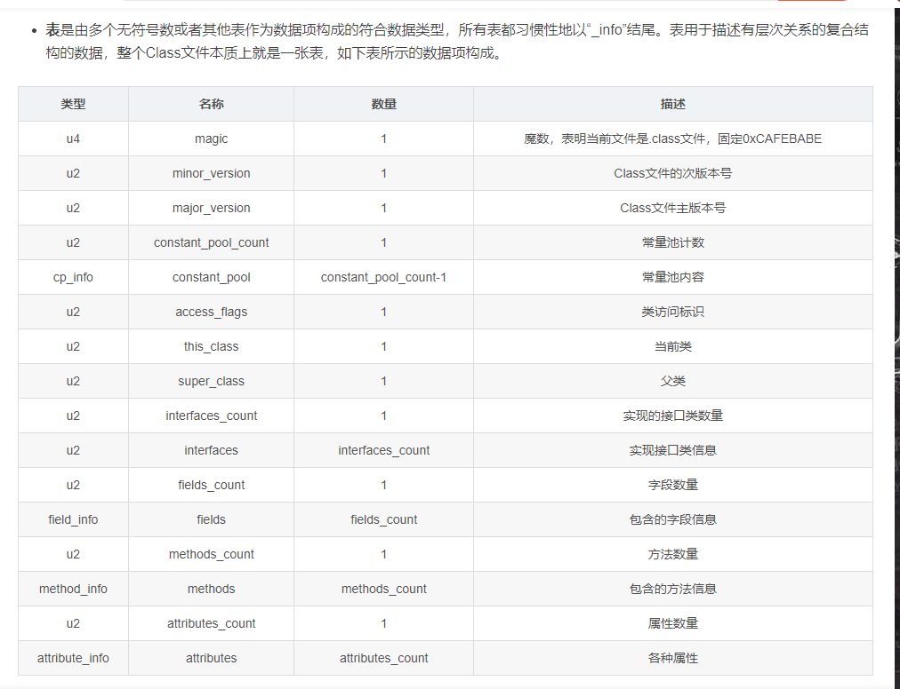
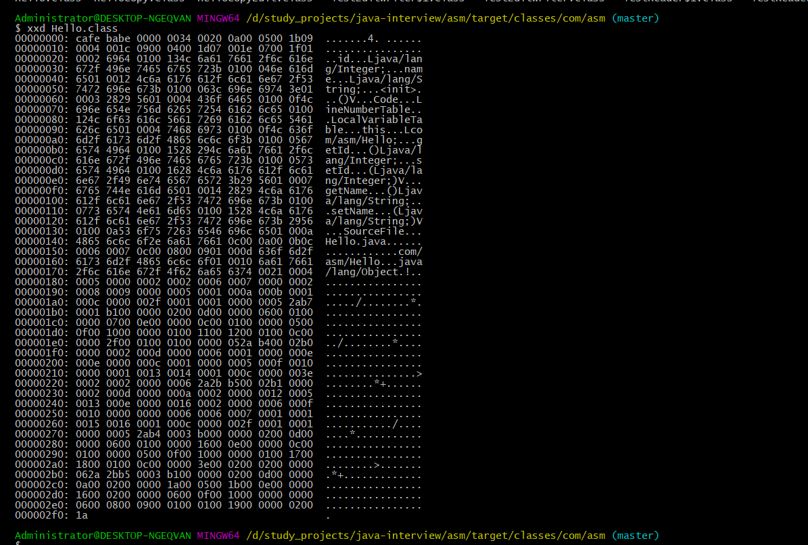

class文件结构：https://blog.csdn.net/qq_34929019/article/details/88661414

类文件 -》 读取器 -》 visit(读/写)

类文件 -》 读取器 -》 适配器 -》visit(读/写) -> 类文件
// 中间层，适配器， 固定结构，拆分，修改，组装

cglb: https://www.bilibili.com/video/BV1dF411q74n/?p=3&spm_id_from=pageDriver&vd_source=c6e59420bb5f9532c866dd3fc121b4ba

